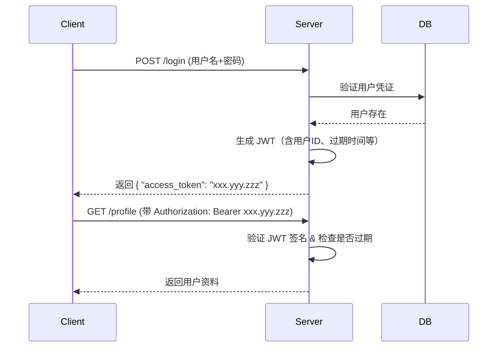

当然可以！JWT（JSON Web Token）是现代 Web 开发中非常常用的**无状态身份认证机制**，而 Redis 则常被用来**增强安全性**或**实现令牌吊销（如登出、封禁）**。下面我会用 **清晰、系统、由浅入深** 的方式带你掌握 JWT 以及它与 Redis 的结合使用。

---

## 🔐 一、什么是 JWT？

JWT（JSON Web Token）是一种**开放标准（RFC 7519）**，用于在各方之间安全地传输信息作为 JSON 对象。这些信息可以被验证和信任，因为它们是**数字签名**的。

### ✅ JWT 的典型用途：
- 用户登录后，服务器返回一个 JWT
- 客户端（如浏览器、App）后续请求时携带该 JWT（通常放在 `Authorization: Bearer <token>` 头中）
- 服务器验证 JWT 合法性，无需查数据库即可知道“这是谁”、“有什么权限”

> 💡 核心思想：**把用户身份信息加密打包成一个字符串，客户端自己保管，服务端只负责验签**

---

## 🧩 二、JWT 的结构

JWT 由三部分组成，用 `.` 连接：

```
xxxxx.yyyyy.zzzzz
```

1. **Header（头部）**  
   - 包含令牌类型（通常是 `JWT`）和签名算法（如 `HS256` 或 `RS256`）
   ```json
   {
     "alg": "HS256",
     "typ": "JWT"
   }
   ```

2. **Payload（载荷）**  
   - 存放实际数据（**不要放敏感信息！如密码**）
   - 可包含标准字段（claims）：
     - `sub`（subject，如用户ID）
     - `exp`（过期时间）
     - `iat`（签发时间）
     - `iss`（签发者）
   ```json
   {
     "sub": "user_123",
     "username": "hero",
     "role": "admin",
     "exp": 1700000000
   }
   ```

3. **Signature（签名）**  
   - 用 Header + Payload + 密钥（secret）通过指定算法生成
   - 用于验证 token 是否被篡改

> 🔒 **关键点**：只要密钥不泄露，别人无法伪造合法 JWT；但 JWT 一旦签发，在过期前始终有效（除非你额外做吊销）

---

## ⚙️ 三、JWT 的工作流程（登录示例）



> ✅ 优点：**无状态**（服务器不用存 session），适合分布式系统  
> ❌ 缺点：**无法主动让 token 失效**（除非过期）

---

## 🔄 四、为什么需要 Redis？——解决 JWT 的“无法吊销”问题

### 问题场景：
- 用户点击“退出登录”，但他的 JWT 还没过期 → 他仍能用这个 token 访问接口！
- 管理员封禁某个用户，但该用户已有有效 token → 仍可操作！

### 解决方案：用 Redis 做 **Token 黑名单（或白名单）**

#### ✅ 方案 A：黑名单（推荐用于“登出”）
- 用户登出时，将该 JWT 的 `jti`（唯一ID）或整个 token 加入 Redis，设置 TTL = 剩余有效期
- 每次请求校验 JWT 后，再查 Redis 看是否在黑名单中

#### ✅ 方方案 B：白名单（更安全但开销大）
- 登录时把 token 存入 Redis（key=用户ID，value=token）
- 每次请求不仅要验证 JWT，还要比对 Redis 中的 token 是否一致
- 登出时直接删除 Redis 中的记录

> 大多数项目采用 **黑名单 + 短期 access_token + 刷新令牌（refresh token）** 的组合

---

## 🛠 五、实战：FastAPI + JWT + Redis 示例

### 1. 安装依赖
```bash
pip install python-jose[cryptography] redis[async]
```

### 2. 生成和验证 JWT（不带 Redis）

```python
# auth_utils.py
from datetime import datetime, timedelta
from jose import jwt, JWTError
from fastapi import Depends, HTTPException, status
from fastapi.security import HTTPBearer, HTTPAuthorizationCredentials

SECRET_KEY = "your-super-secret-key"
ALGORITHM = "HS256"
ACCESS_TOKEN_EXPIRE_MINUTES = 30

def create_access_token(data: dict):
    to_encode = data.copy()
    expire = datetime.utcnow() + timedelta(minutes=ACCESS_TOKEN_EXPIRE_MINUTES)
    to_encode.update({"exp": expire})
    return jwt.encode(to_encode, SECRET_KEY, algorithm=ALGORITHM)

def verify_token(token: str):
    try:
        payload = jwt.decode(token, SECRET_KEY, algorithms=[ALGORITHM])
        return payload
    except JWTError:
        raise HTTPException(status_code=401, detail="Invalid token")
```

### 3. 结合 Redis 做黑名单（登出时加入）

```python
# redis_client.py
import redis.asyncio as redis

redis_client = redis.from_url("redis://localhost:6379/0")
```

```python
# auth_service.py
from .redis_client import redis_client
import hashlib

async def add_token_to_blacklist(token: str, expires_in: int):
    # 用 token 的哈希值作为 key（避免存储完整 token）
    token_hash = hashlib.sha256(token.encode()).hexdigest()
    await redis_client.setex(f"blacklist:{token_hash}", expires_in, "true")

async def is_token_blacklisted(token: str) -> bool:
    token_hash = hashlib.sha256(token.encode()).hexdigest()
    return await redis_client.exists(f"blacklist:{token_hash}")
```

### 4. 在中间件或依赖中校验

```python
# dependencies.py
from fastapi import Request
from .auth_utils import verify_token
from .auth_service import is_token_blacklisted

security = HTTPBearer()

async def get_current_user(
    credentials: HTTPAuthorizationCredentials = Depends(security)
):
    token = credentials.credentials
    payload = verify_token(token)
    
    # 检查黑名单
    if await is_token_blacklisted(token):
        raise HTTPException(status_code=401, detail="Token has been revoked")
    
    return payload["sub"]  # 返回用户ID
```

### 5. 登出接口

```python
# routes/auth.py
@app.post("/logout")
async def logout(
    credentials: HTTPAuthorizationCredentials = Depends(HTTPBearer()),
):
    token = credentials.credentials
    # 计算剩余时间（简化处理：直接用固定过期时间）
    remaining = 30 * 60  # 30分钟
    await add_token_to_blacklist(token, remaining)
    return {"msg": "Logged out successfully"}
```

---

## 📌 六、最佳实践建议

| 项目 | 建议 |
|------|------|
| **密钥管理** | 使用强随机密钥，不要硬编码（用环境变量） |
| **Token 过期时间** | Access Token 短（15~30 分钟），配合 Refresh Token |
| **敏感信息** | 不要放密码、身份证号等到 payload |
| **Redis TTL** | 黑名单的 TTL 应等于 token 剩余有效期 |
| **性能** | Redis 查询很快，一般不影响性能 |
| **替代方案** | 如果不需要“即时登出”，可不用 Redis，靠短过期时间兜底 |

---

## 🎯 总结

- **JWT 是无状态认证利器**，但天生**无法主动失效**
- **Redis 作为外部存储**，可以实现：
  - 登出即失效（黑名单）
  - 强制下线（封禁用户）
  - 单点登录控制（只允许一个设备登录）
- **组合使用 = 安全 + 灵活 + 高性能**

---

如果你想，我可以帮你写一个完整的 FastAPI + JWT + Redis 登录/登出示例项目结构。也可以继续深入讲 **Refresh Token 机制**、**双令牌模式**、**JWT 与 OAuth2 的关系** 等。

你现在对 JWT 和 Redis 的结合有清晰的理解了吗？🙂